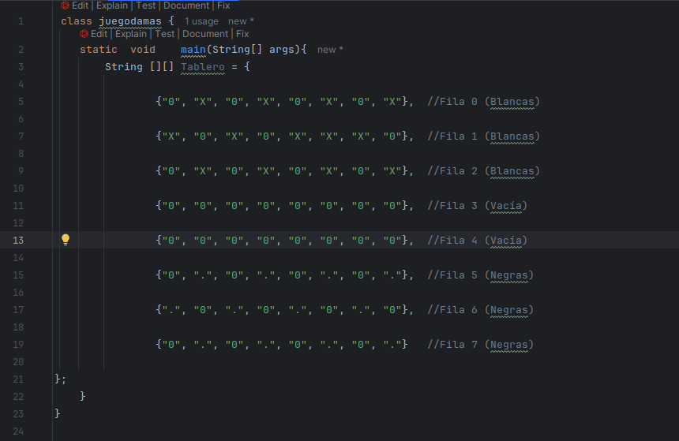

# Examen 1ª Evaluación

---

**Explica a continación cada apartado del examen**

**Con cada apartado realiza un commit diferente**

---

### 1. 

- **Realiza el diagrama de flujo para recorrer un tablero (8x8) de "Damas", sacando por pantalla si la casilla está ocupada (mostrando la coordenada) y que tipo de ficha es. Además cuenta las fichas de cada jugador sacando por pantalla quien va ganando.**

![Ex1COD [MConverter.eu].png](Imagenes/Ex1COD%20%5BMConverter.eu%5D.png)

---

### 2.

- **¿Como es el tablero? Pon un ejemplo**

* Dejo a continuacion una imagen del tablero inicial, pero el documento java esta en la carpeta, llamado juegodamas.

---

### 3.

- **Enumera funciones (mínimo tres) que se podrían utilizar para que el código quede más claro y sea más fácil de mantener.**

#### Listas Ordenadas

1. ***Primera funcion***

    **La primera funcion sera una funcion la cual recorrera el tablero y lo saque por pantalla**

2. ***Segunda funcion***

    **La segunda funcion va a ser una cuenta de fichas totales en el tablero**

3. ***Tercera funcion***

    **La tercera funcion sera una cuenta de fichas blancas(x) y negras (.)**

---

### 4.Realiza el javadoc de estas funciones

   **El javadoc de estas funciones se encuentra en su carpeta respectiva**

