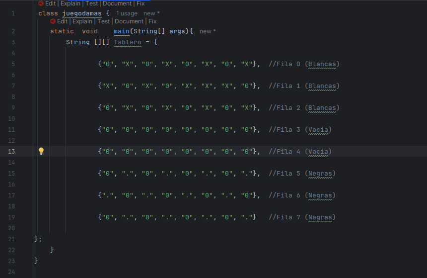

# Examen 1ª Evaluación

---

**Explica a continación cada apartado del examen**

**Con cada apartado realiza un commit diferente**

---

### 1. 

- **Realiza el diagrama de flujo para recorrer un tablero (8x8) de "Damas", sacando por pantalla si la casilla está ocupada (mostrando la coordenada) y que tipo de ficha es. Además cuenta las fichas de cada jugador sacando por pantalla quien va ganando.**

![Ex1COD [MConverter.eu].png](Ex1COD%20%5BMConverter.eu%5D.png)

### 2.

- **¿Como es el tablero? Pon un ejemplo**

* Dejo a continuacion una imagen del tablero inicial, pero el documento java esta en la carpeta, llamado juegodamas.

